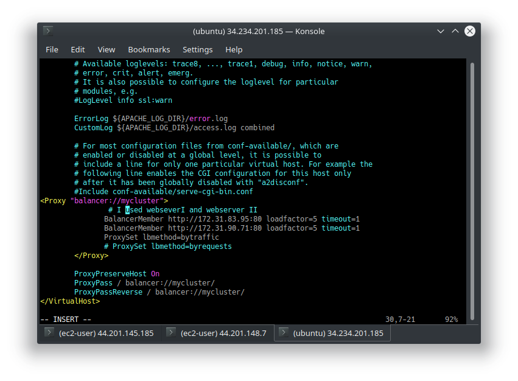

### This project(8) Implements Load balancing on the existing Project(7). 
#### refers to efficiently distributing incoming network traffic across a group of backend servers, also known as a server farm or server pool.
##### submitted by Banjo Babade (Justbj@live.com) to darey.io(Devops learning and mentoship Platform)
 
 
 
 
 
 
 
 
 
 
![Logs from webserver]](Screenshot_20230126_072600.png)

Congratulations!

